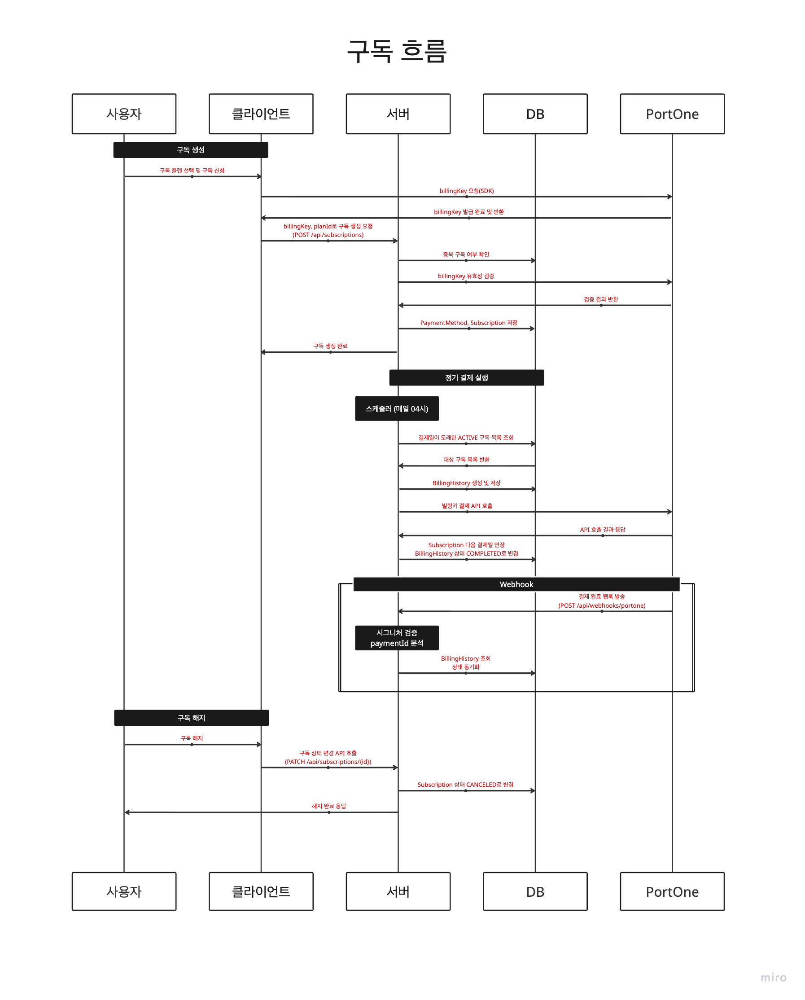
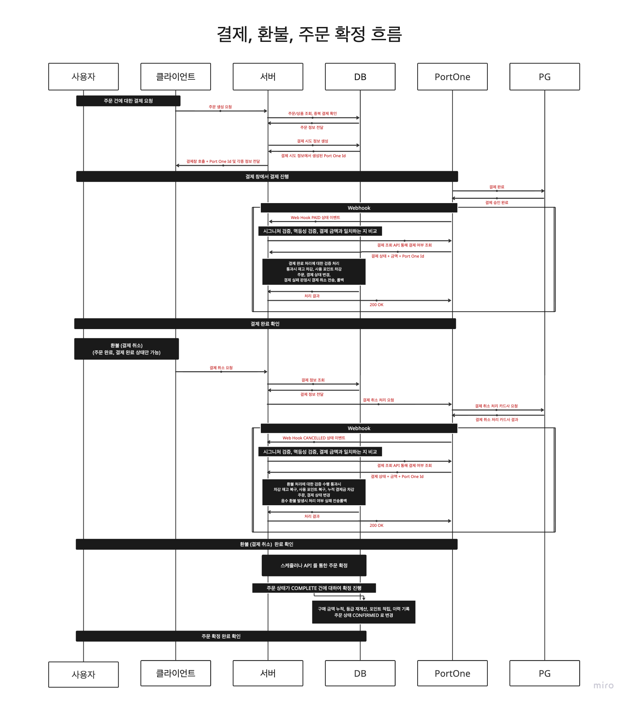

# 커머스 결제 시스템 구축 프로젝트
커머스 결제 시스템 구현

---

## 📋 프로젝트 개요

PortOne 기반 및 Webhook 이벤트 검증을 통한 결제 및 구독 시스템

### 기간

26.02.04 ~ 26.02.20

### 프로젝트 팀 : 5조날다

- 서하나 : Leader, domain-products, order
- 정인호 : domain-members
- 김영재 : domain-payments, Full Refactoring
- 김동진 : domain-webhook, refund, subscriptions

### 목적

- 결제, 환불, 포인트, 멤버쉽, 구독의 정합성과 트랜잭션 처리
- SP Security와 JWT로 보호된 API 인증, 인가 구현
- 결제, 환불, 포인트, 구독 등 사용자 소유권이 중요한 기능 보호
- 서버의 카드 결제 흐름 (결제 확정, 취소, 재고 반영 등) 최종 책임자 관리
- 결제 성공, 실패에 따른 주문 상태 및 상태 관리
- 사용자의 최초 구독 신청 처리 및 빌링키를 발급받아 안전하게 저장
- 저장된 빌링키를 사용해 스케쥴러가 정해진 주기에 자동 결제 시도

### 핵심 특징

- ✅ **UI 템플릿만 제공** - 비즈니스 로직 API는 포함하지 않음
- ✅ **API 계약 기반 개발** - `client-api-config.yml`에서 API 계약 정의
- ✅ **PortOne SDK 통합** - 결제창/빌링키 발급 자동화
- ✅ **3가지 독립적인 결제 플로우**
    - **기본 결제**: 일반 카드 결제 (주문 페이지)
    - **포인트 결제**: 포인트 사용 결제 (포인트 페이지)
    - **구독 결제**: 빌링키 기반 정기결제 (구독 페이지)
    
### 기술 스텍
```bash
Backend
* Language: Java 17
* Framework: Spring Boot 4.0.1
* Build Tool: Gradle
* Database: MySQL
* ORM: Spring Data JPA
* Security: Spring Security, JWT (JSON Web Token)

Payment & Integration
* Payment Gateway: PortOne (KG이니시스, 토스페이먼츠)
* HTTP Client: RestTemplate (외부 API 호출)
* Webhook: PortOne Webhook V2 (HMAC-SHA256 검증)
```

### 주요 기능 :
- 회원 (member) 
  - Spring Security 기반으로 JWT 인증 구조 구현
  - refresh token과 비교해 일치 여부를 검증,불일치 시 토큰 탈취로 판단하여 재발급을 차단
  - 로그아웃 시 Access Token 의 jti 를 저장하고
    필터에서 해당 jti 가 존재하면 인증을 차단해 만료된 블랙리스트 데이터는 스케줄러를 통해 주기적으로 정리

- 주문상품 (order,product) : 
  - 더미 데이터를 활용해 상품 목록 조회와 주문 생성을 구현
  - 주문 생성 시, 클라이언트에서 자동 계산이 되는 주문 총액을 서버에서 한 번 더 검증을 진행함으로써 가격의 위조 방지
  - 주문 번호는 시퀀스 클래스를 생성해 따로 분리해 처리 및 비관적 락을 통해 동시성 방지

- 결제 (payment) :
  - 생성된 주문에 대해 결제 진행, 결제 완료, 결제가 완료된 시점에서의 재고 차감 및 포인트 차감
  - 주문 결제가 완료되면 스케쥴러를 통해 주문 확정 또는 수동 API 호출로 주문 확정
  - 한정된 재고에 대한 동시 결제 가능성을 생각해, 결제 완료 시점에서 웹훅을 통한 검증 단계를 통해 동시 결제에서는 선착순으로 성공, 후속 순위는 결제 실패 후 환불하도록 제어
  - 일반 결제: 상점 → 주문 생성 → 주문 페이지 → 결제 시작 → PortOne 결제창 → 결제 확정
  - 포인트 결제: 포인트 페이지 → 주문 조회 → 주문 선택 → 포인트 입력 → 결제 → 자동 확정

- 구독 (subscription) :
  - PortOne의 빌링키 시스템을 활용해 매월 정해진 날짜에 자동으로 결제가 진행
  - 구독 신청부터 7일간의 무료 체험 기간 이후 정상 과금 전환
  - 해지 및 만료에 이르는 구독의 전체 생명주기 설계
  - 구독 결제: 플랜 선택 → 빌링키 발급 → 구독 생성 → 정기 청구 실행

- 웹훅 (webhook) :
  - 외부 api 호출이 트랜잭션 내에서 이루어지지 않도록 결제 파트에 대한 트랜잭션 전략 생성 구축
  - 일반 결제의 경우 이벤트 수신이 주 목적이기때문에 External과 Internal로 계층 분리를 하여 트랜잭션을 관리
  - 구독 결제는 능동적 요청이 주 목적이라 로직 응집도를 위해 TransactionTemplate로 트랜잭션 범위를 미세 조정
  - 웹훅 처리: HMAC-SHA256 시그니처 검증, 멱등성 처리

각 결제 플로우는 서로 다른 비즈니스 요구사항을 가지고 있습니다

| 플로우 | 페이지 | 포인트 사용 | 확정 방식 | 주요 사용처 |
|--------|--------|------------|----------|------------|
| **기본 결제** | 주문 | ❌ | 수동 | 일반 쇼핑몰 결제 |
| **포인트 결제** | 포인트 | ✅ | 자동 | 포인트 할인 결제 |
| **구독 결제** | 구독 | ❌ | 자동 | 정기 결제 (멤버십, 구독) |

---

## 프로젝트 구조
* ERD
   


* 결제 비즈니스 로직 플로우차트
   


* 구독 비즈니스 로직 플로우차트
   


* 메인 프로젝트 구조
```
src/
├── main/
│   ├── java/com/bootcamp/paymentdemo/
│   │   ├── PaymentDemoApplication.java
│   │   ├── common/
│   │   │   ├── config/               # SecurityConfig, AppProperties 등
│   │   │   ├── controller/           # AuthController, PageController 등
│   │   │   ├── dto/                  # 공통 DTO
│   │   │   ├── entity/               # BaseEntity (공통 엔티티)
│   │   │   ├── exception/            # GlobalExceptionHandler, ErrorEnum
│   │   │   ├── security/             # JwtTokenProvider, JwtAuthenticationFilter
│   │   │   └── Constants.java        # 상수 모음
│   │   │
│   │   └── domain/
│   │       ├── member/               # 회원 도메인
│   │       │   ├── controller/
│   │       │   ├── dto/
│   │       │   ├── entity/
│   │       │   ├── repository/
│   │       │   ├── scheduler/        # AccessTokenBlacklistCleanupScheduler
│   │       │   └── service/
│   │       │
│   │       ├── order/                # 주문 도메인
│   │       │   ├── config/           # OrderConfirmScheduler
│   │       │   ├── controller/
│   │       │   ├── dto/
│   │       │   ├── entity/
│   │       │   ├── repository/
│   │       │   └── service/
│   │       │
│   │       ├── payment/              # 일반 결제 도메인
│   │       │   ├── controller/
│   │       │   ├── dto/
│   │       │   ├── entity/
│   │       │   ├── repository/
│   │       │   ├── service/
│   │       │   └── validator/        # PaymentValidator
│   │       │
│   │       ├── plan/                 # 구독 플랜 도메인
│   │       │   ├── controller/
│   │       │   ├── dto/
│   │       │   ├── entity/
│   │       │   ├── repository/
│   │       │   └── service/
│   │       │
│   │       ├── point/                # 포인트 도메인
│   │       │   ├── entity/
│   │       │   ├── repository/
│   │       │   └── service/
│   │       │
│   │       ├── product/              # 상품 도메인
│   │       │   ├── controller/
│   │       │   ├── dto/
│   │       │   ├── entity/
│   │       │   ├── repository/
│   │       │   └── service/
│   │       │
│   │       ├── refund/               # 환불 도메인
│   │       │   ├── controller/
│   │       │   └── service/
│   │       │
│   │       ├── subscription/         # 구독 결제 도메인
│   │       │   ├── controller/
│   │       │   ├── dto/
│   │       │   ├── entity/           # Subscription, BillingHistory
│   │       │   ├── repository/
│   │       │   ├── scheduler/        # SubscriptionScheduler
│   │       │   └── service/          # SubscriptionService
│   │       │
│   │       └── webhook/              # 웹훅 처리 도메인
│   │           ├── controller/       # WebhookController
│   │           ├── dto/
│   │           ├── entity/
│   │           ├── repository/
│   │           └── service/          # PortOneService, WebhookExternal/InternalService
│   │
│   └── resources/
│       ├── application.yml
│       ├── client-api-config.yml
│       ├── static/
│       └── templates/
```

---

## API 명세서
https://www.notion.so/teamsparta/5-2f62dc3ef5148012b54ef863b7d5561f

---

## 설정 가이드

### 프로젝트 실행

```bash
# Gradle로 실행
./gradlew bootRun

# 또는 IDE에서 실행
# PaymentDemoApplication.java 메인 클래스 실행
```

### PortOne 설정

`src/main/resources/application.yml` 파일에서 PortOne 정보를 설정합니다:

```yaml
portone:
  api:
    base-url: https://api.portone.io
    secret: ${PORTONE_API_SECRET:your-api-secret}                   # PortOne API Secret
    webhook-secret: ${WEBHOOK_SECRET:your-webhook-secret}           # Webhook Secret Key
  store:
    id: ${PORTONE_STORE_ID:your-store-id}                           # PortOne Store ID
  channel:
    kg-inicis: ${PORTONE_CHANNEL_KG:your-kg-inicis-channel-key}     # 일반결제 채널
    toss: ${PORTONE_CHANNEL_TOSS:your-toss-channel-key}             # 정기결제 채널
```

- `kg-inicis`: 일반 결제(주문, 포인트)에 사용
- `toss`: 구독 결제(빌링키 발급)에 사용

### API 계약 설정

`src/main/resources/client-api-config.yml` 파일에서 API 계약을 정의합니다.

#### 기본 구조

```yaml
api:
  base-url: http://localhost:8080              # 백엔드 API 서버 주소

  endpoints:
    # API 이름 (키)
    create-order:
      url: /api/orders                          # ⬅️ 엔드포인트 경로
      method: POST                              # HTTP 메서드
      description: 주문 생성
      request:
        fields:
          - name: items                         # 요청 필드명
            type: array                         # 데이터 타입
            required: true                      # 필수 여부
            description: 주문 아이템 배열
      response:
        body:
          fields:
            - name: orderId                     # 응답 필드명
              type: string
              required: true
              description: 생성된 주문 ID
```

#### URL 필드 추가 방법

각 API에는 `url` 필드가 **필수**입니다. URL이 정의되지 않으면 프론트엔드가 API를 호출할 수 없습니다.

**예시: 결제 시작 API 추가**

```yaml
create-payment:
  url: /api/payments          # ⬅️ 이 부분을 반드시 추가!
  method: POST
  description: 결제 시작
  request:
    fields:
      - name: orderId
        type: string
        required: true
      - name: totalAmount
        type: number
        required: true
      - name: pointsToUse
        type: number
        required: false        # 선택 필드
```

#### Path Parameter 사용

URL에 `{paramName}` 형태로 path parameter를 정의할 수 있습니다:

```yaml
confirm-payment:
  url: /api/payments/{paymentId}/confirm    # ⬅️ {paymentId}가 동적으로 치환됨
  method: POST
  description: 결제 확정
```

JavaScript에서는 다음과 같이 사용합니다:

```javascript
const url = await buildApiUrl('confirm-payment', { paymentId: 'pay_123' });
// 결과: http://localhost:8080/api/payments/pay_123/confirm
```

---

### 동적 API 목록 표시

각 페이지는 필요한 API 목록을 `client-api-config.yml`에서 동적으로 읽어와 화면에 표시합니다.

**예시: 주문 페이지가 필요한 API**

```yaml
# 주문 페이지 (orders.html)는 다음 API들이 필요합니다:
create-payment:       # 결제 시작
  url: /api/payments
confirm-payment:      # 결제 확정
  url: /api/payments/{paymentId}/confirm
cancel-payment:       # 결제 취소
  url: /api/payments/{paymentId}/cancel
```

만약 `url` 필드가 비어있거나 없으면:
- ✅ 정의됨: 화면에 API 정보 표시
- ❌ 미정의: 경고 메시지 표시

---

## 사용 가이드

### 1️⃣ 기본 결제 플로우 (포인트 없음)

**목적**: 일반적인 쇼핑몰 결제 프로세스 (포인트 사용 없음)

#### Step 1: 상품 선택 및 주문 생성

1. **상점** 페이지로 이동
2. 상품 수량 선택 (수량 조절 버튼 사용)
3. "주문 생성" 버튼 클릭
   - **API 호출**: `create-order`
   - **요청**: `{ items: [{ productId, quantity }] }`
   - **응답**: `{ orderId, totalAmount }`
4. 생성된 주문 ID 확인

#### Step 2: 결제 및 확정

1. **주문** 페이지로 이동
2. Order ID 입력 후 조회
3. **사용자 정보 조회** (결제창에 필요)
   - **API 호출**: `get-current-user`
   - **응답**: `{ customerUid, email, name }`
   - `customerUid`는 PortOne 결제창의 `customer.customerId`로 사용됨
4. "결제 시작" 버튼 클릭
   - **API 호출**: `create-payment`
   - **요청**: `{ orderId, totalAmount }`
   - **응답**: `{ paymentId }`
   - **SDK 호출**: `PortOne.requestPayment()` (결제창 열림)
     - `customer.customerId`: customerUid (3번에서 조회)
     - `customer.email`: email (3번에서 조회)
     - `customer.fullName`: name (3번에서 조회)
5. 결제창에서 카드 정보 입력 및 결제 완료
6. "결제 확정" 버튼 클릭
   - **API 호출**: `confirm-payment`
   - **요청**: `{ paymentId }`
   - **응답**: `{ success, status }`

**필요한 API:**
- `list-products` (상품 목록 조회)
- `create-order` (주문 생성)
- `get-current-user` (사용자 정보 조회 - 결제창에 필요)
- `create-payment` (결제 시작)
- `confirm-payment` (결제 확정)
- `cancel-payment` (결제 취소) 

---

### 2️⃣ 포인트 결제 플로우 (포인트 포함)

**목적**: 포인트를 사용한 할인 결제 프로세스

#### Step 1: 주문 조회 및 선택

1. **포인트** 페이지로 이동
2. **API 호출**: `list-orders` (PENDING 상태 주문 자동 조회)
3. 결제할 주문 선택 (카드 클릭)

#### Step 2: 포인트 입력 및 결제

1. **사용자 정보 조회** (결제창에 필요)
   - **API 호출**: `get-current-user`
   - **응답**: `{ customerUid, email, name }`
2. 사용할 포인트 입력 (100P 단위, 모달에서 입력)
3. "결제 진행" 버튼 클릭
   - **API 호출**: `create-payment`
   - **요청**: `{ orderId, totalAmount, pointsToUse }`
   - **응답**: `{ paymentId, finalAmount }`
   - **SDK 호출**: `PortOne.requestPayment()` (포인트 차감된 금액으로 결제)
     - `customer.customerId`: customerUid (1번에서 조회)
     - `customer.email`: email (1번에서 조회)
     - `customer.fullName`: name (1번에서 조회)
4. 결제창에서 카드 정보 입력 및 결제 완료
5. **자동 확정**: `confirm-payment` (자동 호출, 화면에 진행 상황 표시)

**필요한 API:**
- `list-orders` (주문 목록 조회)
- `get-current-user` (사용자 정보 조회 - 결제창에 필요)
- `create-payment` (결제 시작, **pointsToUse 포함**)
- `confirm-payment` (결제 확정)

**주요 차이점:**
- 포인트 페이지는 결제 후 **자동으로 확정**
- 결제 과정이 화면에 단계별로 표시됨
- `create-payment` API에 `pointsToUse` 필드 전달

---

### 3️⃣ 구독 결제 플로우 (정기결제)

**목적**: 빌링키 기반 정기 결제 (멤버십, 구독 서비스)

#### Step 1: 플랜 선택

1. **플랜** 페이지로 이동
2. 구독 플랜 선택 (Basic/Pro/Max)
3. "구독 신청하기" 클릭 → 구독 신청 페이지로 이동

#### Step 2: 빌링키 발급 및 구독 생성

1. **구독 신청** 페이지에서 플랜 ID 입력
2. **사용자 정보 조회** (빌링키 발급에 필요)
   - **API 호출**: `get-current-user`
   - **응답**: `{ customerUid, email, name }`
3. "빌링키 발급 및 구독 신청" 버튼 클릭
   - **SDK 호출**: `PortOne.requestIssueBillingKey()` (카드 등록)
     - `issueId`: customerUid (2번에서 조회)
     - `customer.customerId`: customerUid (2번에서 조회)
     - `customer.email`: email (2번에서 조회)
     - `customer.fullName`: name (2번에서 조회)
   - **응답**: `{ billingKey, customerUid }`
   - **API 호출**: `create-subscription`
   - **요청**: `{ customerUid, planId, billingKey, amount }`
   - **응답**: `{ subscriptionId }`
4. 생성된 구독 ID 확인

#### Step 3: 구독 관리 및 정기 청구

1. **구독 관리** 페이지로 이동
2. Subscription ID 입력 후 조회
   - **API 호출**: `get-subscription`
3. "이번 주기 청구 실행" 버튼 클릭
   - **API 호출**: `create-billing`
   - **요청**: `{ periodStart, periodEnd }`
   - **응답**: `{ billingId, paymentId, amount, status }`
4. 청구 내역 확인
   - **API 호출**: `list-billing-history`

**필요한 API:**
- `get-current-user` (사용자 정보 조회 - 빌링키 발급에 필요)
- `create-subscription` (구독 생성, billingKey 포함)
- `get-subscription` (구독 조회)
- `update-subscription` (구독 해지)
- `create-billing` (즉시 청구)
- `list-billing-history` (청구 내역)

---

## FAQ

### Q1. `client-api-config.yml`에 URL이 없으면 어떻게 되나요?

**A:** 프론트엔드가 API를 호출할 수 없습니다. 각 페이지 상단에 다음과 같은 경고가 표시됩니다:

```
⚠️ 주의: 다음 백엔드 API가 필요합니다
❌ POST /api/payments (미정의)
```

**해결 방법:** `client-api-config.yml`에 `url` 필드를 추가하세요:

```yaml
create-payment:
  url: /api/payments      # ⬅️ 이 필드를 추가!
  method: POST
  # ...
```

---

### Q2. 왜 주문 페이지와 포인트 페이지가 분리되어 있나요?

**A:** 독립적인 테스트를 위해 분리했습니다:

- **주문 페이지**: 기본 결제 플로우 테스트 (포인트 없음, 수동 확정)
- **포인트 페이지**: 포인트 포함 결제 플로우 테스트 (포인트 포함, 자동 확정)

각 플로우는 서로 영향을 주지 않으며, 독립적으로 개발/테스트할 수 있습니다.

---

### Q3. `create-order` API에 `pointsToUse` 필드가 필요한가요?

**A:** 아니요! 주문 생성 시에는 포인트가 필요 없습니다.

```yaml
# ✅ 올바른 주문 생성 API (포인트 없음)
create-order:
  request:
    fields:
      - name: items
        type: array
        required: true
```

포인트는 **결제 시작(`create-payment`)**에서만 사용됩니다:

```yaml
# ✅ 결제 시작 API (포인트 선택사항)
create-payment:
  request:
    fields:
      - name: orderId
        type: string
        required: true
      - name: pointsToUse      # ⬅️ 여기서만 사용!
        type: number
        required: false
```

---

### Q4. `openPortOnePayment()`와 `openPortOnePaymentWithPoints()`의 차이는?

**A:** 두 함수는 서로 다른 시나리오를 위해 분리되어 있습니다:

| 함수 | 페이지 | 포인트 | `create-payment` 호출 | PortOne SDK 금액 |
|------|--------|--------|-----------------------|------------------|
| `openPortOnePayment()` | 주문 | ❌ 없음 | pointsToUse 없음 | totalAmount 그대로 |
| `openPortOnePaymentWithPoints()` | 포인트 | ✅ 포함 | pointsToUse 포함 | totalAmount - pointsToUse |

---

### Q5. 상점에서 주문 생성 후 바로 결제할 수 없나요?

**A:** 의도적으로 분리했습니다:

- **상점 페이지**: 주문만 생성 (장바구니 역할)
- **주문/포인트 페이지**: 결제 처리 (결제 모듈 역할)

**이렇게 분리하면:**
1. 주문과 결제 도메인을 명확히 구분
2. 각 기능을 독립적으로 테스트
3. 여러 주문을 모아서 한 번에 결제 가능
4. 향후 확장 시 유연하게 대응

---

### Q6. API가 구현되지 않았는데 어떻게 테스트하나요?

**A:** 각 페이지는 필요한 API가 `client-api-config.yml`에 정의되어 있는지 확인하고:

- ✅ 정의됨: API 정보 표시, 호출 가능
- ❌ 미정의: 경고 표시, 호출 불가

**단계별 개발 흐름:**

1. `client-api-config.yml`에 API 계약 정의 (url, 필드 등)
2. 프론트엔드에서 해당 API 호출 테스트 (에러 확인)
3. 백엔드 API 구현
4. 프론트엔드와 통합 테스트

---

### Q7. `get-current-user`는 언제 호출하나요?

**A:** PortOne 결제창 또는 빌링키 발급 전에 **반드시** 호출해야 합니다.

**이유:** PortOne SDK는 고객 정보(`customer`)가 필요합니다:

```javascript
// PortOne 결제창에 필요한 정보
{
  customer: {
    customerId: "cust_001",      // ⬅️ get-current-user의 customerUid
    email: "test@example.com",   // ⬅️ get-current-user의 email
    fullName: "홍길동",           // ⬅️ get-current-user의 name
    phoneNumber: "01012345678"
  }
}
```

**호출 시점:**

| 플로우 | 호출 시점 | 사용 목적 |
|--------|----------|----------|
| 기본 결제 | 결제 시작 버튼 클릭 전 | 결제창 customer 정보 |
| 포인트 결제 | 결제 진행 버튼 클릭 전 | 결제창 customer 정보 |
| 구독 결제 | 빌링키 발급 버튼 클릭 전 | 빌링키 issueId & customer 정보 |

**주의사항:**
- `customerUid`는 서버에서 관리하는 고유 식별자입니다
- 프론트엔드에서 임의로 생성하지 마세요
- 페이지 로드 시 한 번 조회하고 캐싱해서 사용할 수 있습니다

---

### Q8. PortOne 테스트 카드 번호는?

**A:** PortOne 개발자 문서를 참고하세요:

- 테스트 카드: `4000-0000-0000-0008`
- 유효기간: 임의 입력 (예: 12/28)
- CVC: 임의 입력 (예: 123)

---

### Q9. CORS 에러가 발생합니다.

**A:** 백엔드 서버에서 CORS를 허용해야 합니다:

```java
@Configuration
public class CorsConfig implements WebMvcConfigurer {
    @Override
    public void addCorsMappings(CorsRegistry registry) {
        registry.addMapping("/**")
            .allowedOrigins("http://localhost:8080")
            .allowedMethods("GET", "POST", "PUT", "PATCH", "DELETE")
            .allowedHeaders("*")
            .allowCredentials(true);
    }
}
```

---

### Q10. JWT 토큰은 어떻게 관리하나요?

**A:** 현재 데모 버전은 간단한 JWT 인증을 포함합니다:

1. 로그인 시 서버가 JWT 토큰 발급
2. 쿠키에 저장 (`authToken`)
3. 이후 모든 API 요청에 자동으로 포함

**실제 구현 시:**
- HttpOnly 쿠키 사용 (XSS 방지)
- Secure 플래그 설정 (HTTPS)
- Refresh Token 구현
- 토큰 만료 시 재발급

---

### Q11. `base-url`을 변경하려면?

**A:** `client-api-config.yml`의 `api.base-url`을 수정하세요:

```yaml
api:
  base-url: http://localhost:9090    # ⬅️ 백엔드 서버 주소 변경
```

모든 API 호출이 자동으로 이 주소를 사용합니다.

---

## 🐛 문제 해결

### 설정이 로드되지 않는 경우

1. 브라우저 개발자 도구 → Network 탭 확인
2. `/api/public/config` 엔드포인트 응답 확인
3. 콘솔에서 `window.APP_RUNTIME.config` 확인

### PortOne SDK 에러

1. PortOne SDK 스크립트 로드 확인 (브라우저 콘솔)
2. Store ID / Channel Key 정확성 확인
3. 브라우저 콘솔에서 에러 메시지 확인

### API 호출 실패

1. `client-api-config.yml`의 `base-url` 확인
2. `url` 필드가 정의되어 있는지 확인
3. CORS 설정 확인 (백엔드 서버)
4. 브라우저 개발자 도구 → Network 탭에서 요청/응답 확인

### 포인트 결제 시 금액이 이상합니다

1. 서버에서 포인트 차감 로직 확인:
   ```
   finalAmount = totalAmount - pointsToUse
   ```
2. `create-payment` API가 `pointsToUse`를 올바르게 처리하는지 확인
3. PortOne SDK에 전달되는 금액이 `finalAmount`인지 확인

---

## 📚 참고 자료

### PortOne 문서
- [PortOne 개발자 문서](https://developers.portone.io/)
- [PortOne SDK v2](https://developers.portone.io/docs/ko/sdk/browser-sdk)
- [빌링키 발급 가이드](https://developers.portone.io/docs/ko/auth/guide/readme)

### Spring Boot
- [Spring Boot 공식 문서](https://spring.io/projects/spring-boot)
- [Thymeleaf 공식 문서](https://www.thymeleaf.org/documentation.html)

---
